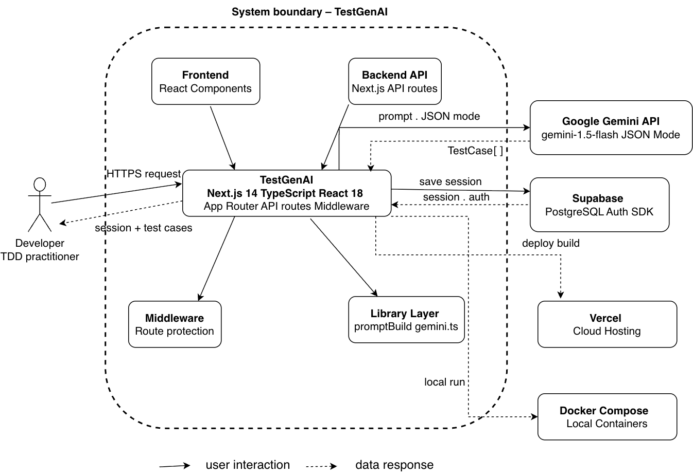
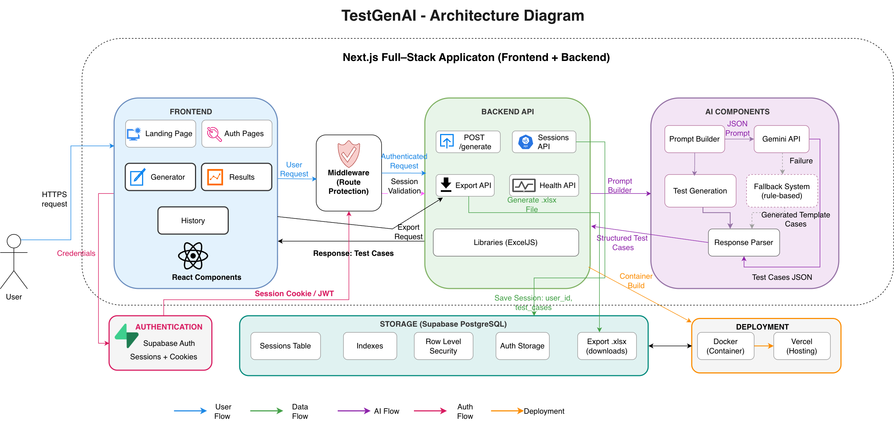
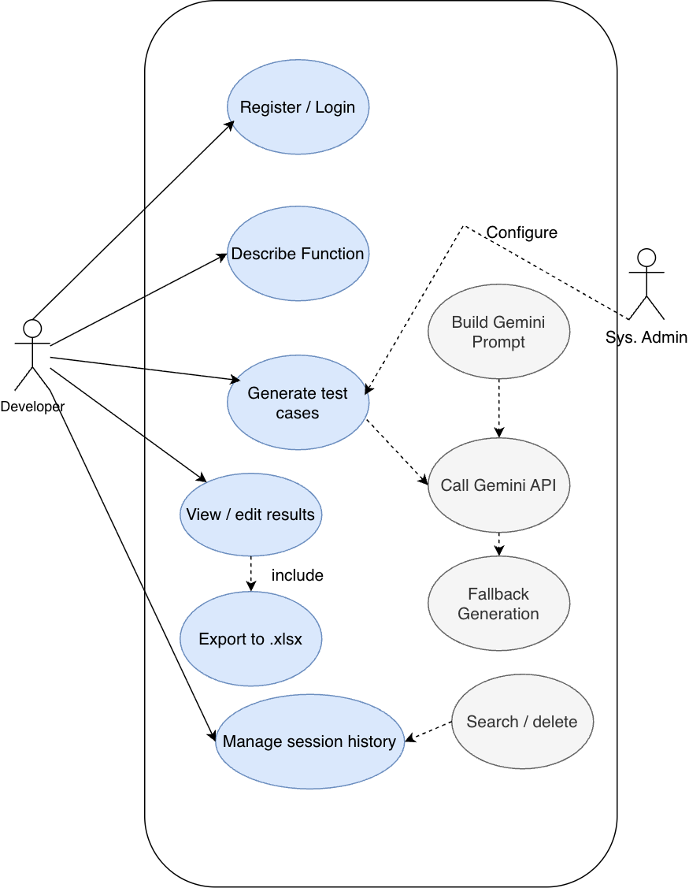

## TestGenAI – Pre-Code Unit Test Case Generator

An AI-powered full-stack web application that automatically generates structured unit test cases before code implementation, supporting Test-Driven Development (TDD).

---

## Live Demo & Credentials
- **Live Application**: [https://test-gen-ai-ks9a.onrender.com/](https://test-gen-ai-ks9a.onrender.com/)
- **Evaluator Access**:
  - **Email**: `testgenai123@gmail.com`
  - **Password**: `testgenai123`

## Overview

Test-Driven Development (TDD) requires test cases before coding. This process is manual, time-consuming (20–40 minutes per function), and inconsistent.

TestGenAI automates this process using AI to generate structured test cases in **under 10 seconds**.

---

## Technology Stack
| **Component**                      | **Technologies**                                   |
| ---------------------------------- | -------------------------------------------------- |
| **Framework**                      | Next.js 14, TypeScript 5, React 18                 |
| **AI Engine**                      | Google Gemini API                                  |
| **Database Layer**                 | Supabase PostgreSQL                                |
| **Excel Export Module**            | ExcelJS (.xlsx with formatted headers)             |
| **Authentication**                 | Supabase Auth                                      |
| **DevOps & CI/CD**                 | Docker, Docker Compose                             |
| **Deployment**                     | Render (Optimized Standalone Build)               |

## Project Structure

```text
.
├── app/                  # Next.js app router pages and API routes
├── components/           # Reusable UI React components
├── docs/                 # Project documentation and specifications
├── images/               # Architecture and use case diagrams
├── lib/                  # Shared utilities, helpers, and configurations
├── public/               # Static assets (favicons, etc.)
├── supabase/             # Supabase database and migration configurations
├── types/                # Global TypeScript type definitions
├── __tests__/            # Unit and component test suites
├── Dockerfile            # Docker configuration for production deployment
├── docker-compose.yml    # Docker compose setup for local environment
├── middleware.ts         # Next.js route protection and session middleware
└── package.json          # Project dependencies and commands
```
## System Design

### System Context Diagram


This diagram presents a high-level view of the system, showing how users interact with external services.
### System Architecture Diagram


The system architecture illustrates the interaction between frontend, backend, AI engine, and database.

### Use Case Diagram


This diagram represents the key functionalities available to users.

## Workflow

1. User logs in  
2. Inputs function details  
3. API sends request to Gemini  
4. AI generates test cases  
5. Results stored in Supabase  
6. User edits or exports  

## Key Features
- **Intelligent Generation**: Uses Google Gemini to construct comprehensive testing suites including edge cases and boundary conditions.
- **Structured Workspace**: Inline editable test case tables for late-stage refinements.
- **Excel Professional Export**: Formatted `.xlsx` exports with alternating row colors and professional headers.
- **Session Persistence**: Automatic Supabase persistence for all test generation sessions.
- **History Library**: Search, filter, reload, and manage your past test suites on demand.
- **Premium UI**: Multi-page navigation with high-performance QA-themed canvas animations and glassmorphism.

## Goals
- Eliminate manual effort in writing test cases in Excel by auto-generating structured and standardized test sheets.
- Support multiple development flows by enabling developers to define tests before implementing code.
- Provide a standardized and time-saving solution that accelerates the development process and enhances software quality overall.

## Functional Requirements
- **FR-01**: Auto-generate 6+ test cases (Happy Path, Boundary, Negative, Edge).
- **FR-02**: Real-time Supabase persistence (< 2s).
- **FR-03**: Advanced history filtering (Function Name, Type).
- **FR-04**: Formatted Excel (.xlsx) export functionality.
- **FR-05**: Secure Email/Password Authentication (Supabase).
- **FR-06**: Route protection and unauthorized redirection.
- **FR-07**: Dynamic inline editing for all test case entries.
- **FR-08**: Containerized deployment via Docker Compose.

## Non-Functional Requirements
- **Performance**: End-to-end generation in < 8s (p90).
- **Availability**: 99.5% uptime on cloud environments.
- **Security**: Zero client-side secrets; 100% auth coverage.
- **Maintainability**: Strict TypeScript and full JSDoc documentation.
- **Portability**: Parity between local Docker and Vercel cloud.

## Risks & Strategies
- **AI Reliability**: Managed via behavior-specific prompting and inline editing for manual correction.
- **Data Integrity**: Ensured through Supabase PostgreSQL constraints and real-time validation.
- **Scalability**: Addressed by optimized standalone builds and cloud-native database scaling.
## Results
- 100% category coverage
- 100% ≥6 test cases
- 98.7% field completeness
- 10% fallback usage
## Testing
- Unit Testing (Jest)
- Integration Testing (API endpoints).
- End-to-End Testing
## Challenges
- Prompt engineering complexity
- Supabase SSR authentication issues
- Docker configuration challenges
## Ethical Considerations
- AI outputs require validation
- Secure API key handling
- Data privacy considerations
- Transparency of AI-generated content
## Future Scope
- IDE integration
- Auto test code generation
- Redis rate limiting
- Supabase RLS
- CI/CD pipeline
- Collaboration features
## Getting Started

### 1. Prerequisites
- **Node.js**: v18.x or higher
- **Docker**: Optional, for containerized execution

### 2. Environment Configuration
Create a `.env.local` file in the root directory and populate it with your credentials:
```bash
GEMINI_API_KEY=your_gemini_key
NEXT_PUBLIC_SUPABASE_URL=your_supabase_url
NEXT_PUBLIC_SUPABASE_ANON_KEY=your_anon_key
SUPABASE_SERVICE_ROLE_KEY=your_service_role_key
```

### 3. Installation
Install the project dependencies using npm:
```bash
npm install
```

### 4. Running the Application
#### Development Mode
Start the local development server:
```bash
npm run dev
```
The application will be available at `http://localhost:3000`.

#### Production Build
To create an optimized production build:
```bash
npm run build
npm start
```

### 5. Docker Deployment (Recommended)
You can launch the entire stack (app + services) using Docker Compose:
```bash
docker compose up --build
```

## Project Status
1. Conception Phase – Completed
2. Development Phase – Completed
3. Finalization Completed – Completed

## Author

Raksha Rajkumar Kademani
MSc Computer Science – IU International University of Applied Sciences, Berlin